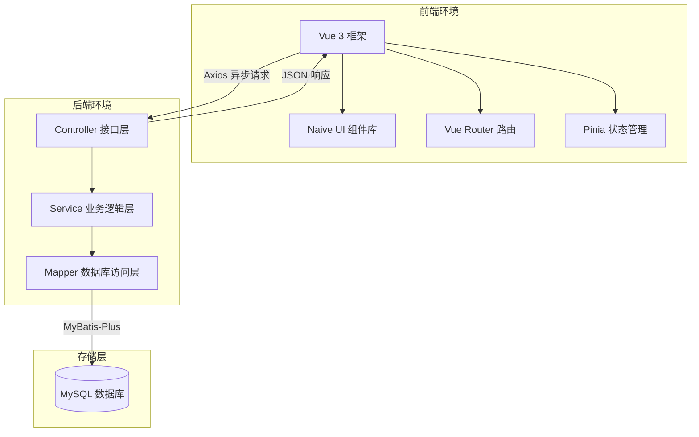

学生院别：

学生专业：

学号：

个人成绩：


# [Java企业级应用开发]{.underline} 课程设计报告

> **题目：** 新闻发布与管理系统的设计与实现

##  开课学院： 

##  指导老师： 

##  小组成员： 

##  专业班级： 

[2025]{.underline} ------ [2026]{.underline} 学年第 [2]{.underline} 学期

**正文**

## 题目概述
在当今互联网高速发展的时代，信息的传播与获取变得尤为快捷。新闻作为获取社会动态和行业信息的重要途径，其时效性与内容的丰富性备受关注。传统的人工维护新闻模式不仅效率低下，且难以满足用户实时交互、多维度分类检索和全方位评论监管的需求。

本系统定位为一个新闻发布与管理系统，包含前台新闻展示和后台内容管理两个部分。前台主要面向普通用户，提供注册、登录、新闻浏览、新闻详情查看和评论发布功能。后台主要面向管理员，提供用户管理、新闻分类管理、新闻管理、评论管理、封面上传和首页统计功能。通过开发这样一个稳定、高效的新闻发布与管理系统，对于提高内容管理效率和增强用户体验具有重要的实际应用价值。

## 需求分析

### 1. 角色与权限分析
本系统根据业务需求，设计了两种不同的用户角色：
* **游客与普通用户**：
  * 游客可以浏览已发布的新闻列表、按分类进行筛选、使用关键字搜索新闻，以及查看新闻详情和评论。
  * 普通用户在登录后，除了拥有游客的所有权限外，还可以发表评论、删除自己发表的评论，以及在个人中心修改个人基本信息。
* **系统管理员**：
  * 拥有后台管理系统的全部权限。
  * 具备后台首页统计看板查看、用户管理、新闻分类管理、新闻内容管理和评论监督管理能力。
  * 负责新闻封面的上传以及 Markdown 格式新闻的发布与状态控制。

### 2. 功能需求规格
系统共划分出八个功能模块，各模块的职责如下：
* **认证管理模块**：提供用户注册、通用登录、Token 鉴权以及退出登录功能。
* **前台新闻模块**：提供新闻列表分页加载、新闻分类筛选、标题模糊搜索、新闻详情展示和浏览量自增。
* **评论交互模块**：提供新闻详情页评论加载、登录用户发表评论（限制纯文本，500字以内）、删除个人历史评论，以及后台隐藏/删除评论。
* **用户管理模块**：提供用户列表查询、新增后台/前台用户、用户属性修改、账户禁用与启用、密码强制重置。
* **新闻分类模块**：提供分类的创建、更新、逻辑删除（若分类下有新闻则拒绝删除）、状态更改（启用或禁用）和优先级排序。
* **新闻管理模块**：提供新闻的草稿保存、正式发布、下架管理、内容二次编辑和逻辑删除。新闻正文支持 Markdown 语法。
* **文件上传模块**：提供新闻封面图片上传，限制图片格式为 JPG、JPEG、PNG，大小限制在 2MB 以内。
* **数据统计模块**：为管理员提供仪表盘，包含用户总数、新闻总数、分类总数、评论总数以及不同状态新闻的分布数量。

### 3. 非功能需求分析
* **安全性**：用户密码必须通过 BCrypt 进行加盐哈希加密存储；敏感接口必须通过自定义拦截器实施 JWT 签名验证；后台管理接口需拦截并校验用户角色属性。
* **性能效率**：列表查询强制使用分页；新闻列表页仅返回摘要等简要信息，只有进入详情页才传输完整的 Markdown 正文；常用检索字段建立索引。
* **易用性**：前端使用 Naive UI 保证界面清爽美观；交互操作提供二次确认弹窗；表单录入提供前端与后端的双重校验提示。
* **可维护性**：后端遵循 Controller、Service、Mapper 的三层架构，统一使用接口返回对象和全局异常拦截；前端代码采用模块化组织，不使用大型繁琐模板。

## 系统设计

### 1. 总体架构设计
系统采用典型的前后端分离应用架构。前端项目在浏览器中运行，通过 Axios 库向后端发送异步请求。后端基于 Spring Boot 框架接收请求，解析业务逻辑，并通过 MyBatis-Plus 操作 MySQL 数据库进行持久化。



### 2. 数据库设计

#### 2.1 实体关系模型说明
系统包含四个核心实体：用户、新闻分类、新闻、评论。
* 一个用户可以发布多篇新闻（一对多关系）。
* 一个用户可以发表多条评论（一对多关系）。
* 一个新闻分类可以对应多篇新闻（一对多关系）。
* 一篇新闻可以拥有多条评论（一对多关系）。

#### 2.2 数据库物理结构


### 3. 功能模块划分设计
为了实现系统的合理分工与职责拆解，系统在功能模块的设计上进行了清晰的划分：
* **前台新闻客户端**：
  * **用户自助服务**：提供用户登录、用户注册以及个人基本资料修改。
  * **新闻检索浏览**：提供新闻列表的分页展示、新闻分类的多维度筛选过滤、新闻标题的关键词模糊检索以及新闻详情的图文阅读。
  * **评论互动模块**：提供历史评论的列表浏览、已登录用户的纯文本评论发表以及用户对自己发布评论的自主删除。
* **后台新闻 management 端**：
  * **大屏统计看板**：以数字和占比图表的形式展示用户数、分类数、新闻数、评论数以及新闻发布状态。
  * **用户维护管理**：提供后台账户的增删改查、账户状态的启用与禁用、密码重置。
  * **分类标签管理**：提供新闻分类的新建、编辑、逻辑删除及优先级排序控制。
  * **新闻内容发布**：提供 Markdown 格式的内容编写、封面图上传、状态管理。
  * **评论监督管理**：提供对全站评论的检索审查、垃圾评论的隐藏与逻辑删除。

### 4. 核心类与包结构设计
后端项目遵循分层架构开发，结构设计清晰，各层组件职责明确：
* **实体类包 (entity)**：定义了与 MySQL 数据表结构一一对应的持久化实体类，如 `User`、`NewsCategory`、`News` 与 `NewsComment`。
* **数据访问接口层 (mapper)**：定义了面向数据库进行增删改查的基础接口，直接继承自 MyBatis-Plus 的基类 Mapper，如 `NewsMapper` 与 `UserMapper`。
* **业务逻辑层 (service)**：封装了核心 of 业务校验逻辑和持久化调用，如处理账户防重名的 `UserService` 与负责逻辑删除的 `NewsServiceImpl`。
* **控制层 (controller)**：作为对外公开的 RESTful 接口层，使用统一返回结果对象包裹数据，代表类如 `AuthController` 与 `AdminDashboardController`。
* **安全鉴权包 (security)**：包含了 JWT 加密与解密的工具组件以及在拦截器链中执行 Token 校验与角色判断的类，如自定义拦截器类 `JwtInterceptor`。

## 系统实现

### 1. 开发环境与技术栈配置
* **软件开发环境**：集成开发环境为 IntelliJ IDEA，前端开发工具使用 Vite，运行环境为 Node.js 与 JDK 17，数据层选用 MySQL 8.0 数据库，并使用 Git 进行版本控制。
* **系统技术栈**：后端基于 Spring Boot 框架，引入 MyBatis-Plus 作为持久层框架，使用 Spring Validation 做参数校验，基于 JWT 与 BCrypt 保证账户安全；前端基于 Vue 3 核心框架，辅以 Naive UI 界面组件库、Axios 请求处理、Vue Router 路由控制、Pinia 状态管理以及 md-editor-v3 渲染 Markdown 正文。

### 2. 安全认证与拦截编码实现
后端开发中，通过配置自定义拦截器来对非公开接口进行拦截，通过在请求头中提取 Token 并调用 JWT 工具类进行解析，从而将登录用户的个人信息绑定至当前请求线程上下文中，便于后续业务层直接读取。
密码安全上，用户注册和修改密码时，均通过加密算法对明文密码进行处理，随后再将生成的密文写入数据库，确保即使数据库泄露也无法还原用户原始密码。

### 3. 统一返回结果与异常拦截实现
后端采用统一数据返回格式与全局异常捕获，以保障系统健壮性与前后台接口的交互一致性。
```java
// 统一返回结果封装
public class Result<T> {
    private Integer code;
    private String message;
    private T data;

    public static <T> Result<T> success(T data) {
        Result<T> result = new Result<>();
        result.setCode(200);
        result.setMessage("操作成功");
        result.setData(data);
        return result;
    }

    public static <T> Result<T> error(Integer code, String message) {
        Result<T> result = new Result<>();
        result.setCode(code);
        result.setMessage(message);
        return result;
    }
}
```
通过配置全局异常拦截器，能够自动捕获接口层的参数校验异常及业务异常，避免向前端抛出底层堆栈信息：
```java
// 全局异常拦截器
@RestControllerAdvice
public class GlobalExceptionHandler {
    @ExceptionHandler(BusinessException.class)
    public Result<?> handleBusinessException(BusinessException e) {
        return Result.error(e.getCode(), e.getMessage());
    }

    @ExceptionHandler(MethodArgumentNotValidException.class)
    public Result<?> handleValidException(MethodArgumentNotValidException e) {
        String message = e.getBindingResult().getFieldError().getDefaultMessage();
        return Result.error(400, message);
    }

    @ExceptionHandler(Exception.class)
    public Result<?> handleException(Exception e) {
        return Result.error(500, "系统繁忙，请稍后再试");
    }
}
```

### 4. 核心鉴权拦截器编码实现
利用拦截器实现基于 Token 的轻量级拦截鉴权机制：
```java
// 自定义 JWT 拦截器类
@Component
public class JwtInterceptor implements HandlerInterceptor {
    @Autowired
    private JwtUtils jwtUtils;

    @Override
    public boolean preHandle(HttpServletRequest request, HttpServletResponse response, Object handler) throws Exception {
        // 放行跨域预检请求
        if ("OPTIONS".equals(request.getMethod())) {
            return true;
        }
        
        String token = request.getHeader("Authorization");
        if (StringUtils.hasText(token) && token.startsWith("Bearer ")) {
            token = token.substring(7);
            Claims claims = jwtUtils.parseToken(token);
            if (claims != null) {
                // 绑定到当前线程上下文
                UserContext.setUser(
                    claims.get("userId", Long.class), 
                    claims.get("role", String.class)
                );
                return true;
            }
        }
        throw new BusinessException(401, "请先登录或登录状态已失效");
    }
}
```

### 5. 核心业务与路径映射实现
* **文件上传及映射**：为避免大量图片数据占用数据库空间，系统将图片文件物理保存在服务器宿主机目录，将生成的相对文件名写入对应表。为了能够在前端正常渲染，通过实现配置类将磁盘物理路径映射为静态资源访问地址。
* **分级评论机制**：前台加载新闻时，将拉取对应新闻下所有状态为显示且逻辑删除标记为正常的评论记录。由于删减操作需要验证操作者身份，删除接口被拦截器保护，普通用户仅能注销自身发布的评论，而管理员可以对任意不合规评论进行隐藏或删除。

### 6. 前端页面组件与布局设计
前端采用轻量自定义开发，为前台和后台配置了不同的视图布局：
* **前台布局**：包括顶部的自适应导航栏、中部的内容展示卡片以及页脚的版权声明。新闻正文展示引入 Markdown 渲染组件，配合样式表实现段落排版。
* **后台布局**：左侧为多级树形导航菜单，支持展开和收起；顶部为面包屑导航及管理员信息展示，支持一键登出；右侧内容区域为带滚动条的单页面应用视图。

### 7. 系统运行界面展示

#### 7.1 用户登录与注册页面
前台普通用户可通过注册页面完成账户初始化。登录界面作为统一入口，用户输入账号与密码后，系统经过格式检验送往后端处理，成功后分流跳转。
```
+---------------------------------------------------------+
|                                                         |
|                     [ 登录 / 注册 ]                     |
|                                                         |
|   用户名: [ 占位输入框 ]                                |
|   密  码: [ 占位输入框 ]                                |
|                                                         |
|       ( 登录 )       ( 去注册 )                         |
|                                                         |
+---------------------------------------------------------+
[截图占位符：用户登录与注册界面]
```

#### 7.2 前台新闻浏览列表
前台首页展示所有处于发布状态的新闻列表。用户可在顶部根据分类选项卡进行点击过滤，或在搜索栏中输入关键字完成匹配检索。
```
+---------------------------------------------------------+
|  [ MoeNews 导航栏 ]               ( 搜索框 )  [ 登录 ]  |
+---------------------------------------------------------+
|  [ 分类1 ]  [ 分类2 ]  [ 分类3 ]                        |
+---------------------------------------------------------+
|  +--------------------+   +--------------------+        |
|  | 新闻标题A           |   | 新闻标题B           |        |
|  | [封面图片占位]      |   | [封面图片占位]      |        |
|  | 新闻摘要...         |   | 新闻摘要...         |        |
|  | ( 2026-06-27 )      |   | ( 2026-06-27 )      |        |
|  +--------------------+   +--------------------+        |
+---------------------------------------------------------+
[截图占位符：前台新闻列表与筛选检索界面]
```

#### 7.3 新闻详情与评论发表
用户点击列表中任意新闻卡片后跳转至新闻详情页。正文由富文本预览器对 Markdown 进行展示，底部列出历史评论。登录用户可填入内容并发表。
```
+---------------------------------------------------------+
|  [ MoeNews 导航栏 ]                                     |
+---------------------------------------------------------+
|  <h1>新闻标题A</h1>                                      |
|  时间: 2026-06-27 | 浏览量: 100                          |
|  -----------------------------------------------------  |
|  [ Markdown 渲染的新闻正文内容，支持代码高亮与列表 ]    |
|  -----------------------------------------------------  |
|  评论区:                                                |
|  - 张三: 写的很棒！ ( 2026-06-27 )                       |
|  - 李四: 对此表示赞同。 ( 2026-06-27 )                   |
|                                                         |
|  [ 请输入评论内容... ]                                  |
|  ( 发表评论 )                                           |
+---------------------------------------------------------+
[截图占位符：前台新闻详情渲染与评论互动界面]
```

#### 7.4 后台管理系统主页
管理员登录后直接进入后台主页。该页面直观展示了仪表盘，包含四个核心实体的统计总数以及新闻状态图表。
```
+---------------------------------------------------------+
| [MoeNews 后台]   欢迎您，系统管理员 admin               |
+---------------------------------------------------------+
| (菜单栏)   |  +---------+ +---------+ +---------+        |
| - 首页     |  | 用户总数| | 新闻总数| | 分类总数|        |
| - 用户管理 |  |   10人  | |   25篇  | |    5个  |        |
| - 新闻管理 |  +---------+ +---------+ +---------+        |
| - 分类管理 |  新闻状态统计:                              |
| - 评论管理 |  已发布 [=== 80% ===]                       |
|            |  草稿   [= 10% =]                           |
|            |  已下架 [= 10% =]                           |
+---------------------------------------------------------+
[截图占位符：后台首页数据统计大屏界面]
```

#### 7.5 后台新闻编辑与 Markdown 编辑器
管理员发布或编辑新闻时进入此页。系统集成了 Markdown 预览编辑器，左侧为源码输入区，右侧显示实时渲染排版，支持上传本地图片作为封面。
```
+---------------------------------------------------------+
| [MoeNews 后台] > 发布新闻                               |
+---------------------------------------------------------+
| 标题: [ 占位输入框 ]     分类: [ 下拉选择框 ]            |
| 封面: [ + 上传封面图片 ]                                |
| 摘要: [ 占位输入框 ]                                    |
| +-----------------------------------------------------+ |
| | (编辑区)                        | (预览区)          | |
| | # 标题                          | 标题              | |
| | 正文内容                        | 正文内容          | |
| |                                 |                   | |
| +-----------------------------------------------------+ |
| ( 保存草稿 )       ( 正式发布 )                         |
+---------------------------------------------------------+
[截图占位符：后台新闻编辑与实时 Markdown 预览界面]
```

#### 7.6 用户与评论监督管理
管理员在用户管理界面对违规账户进行封禁；在评论管理界面中，可对各种敏感或垃圾评论一键执行“隐藏”操作，使得前台不再进行渲染。
```
+---------------------------------------------------------+
| [MoeNews 后台] > 评论管理                               |
+---------------------------------------------------------+
| 搜索内容: [ 占位框 ]     状态: [ 启用/禁用 ]            |
| +-----------------------------------------------------+ |
| | 用户名 | 评论内容         | 状态 | 操作             | |
| |--------|------------------|------|------------------| |
| | user   | 违规评论内容A    | 显示 | [隐藏] [删除]    | |
| | test   | 正常评论内容B    | 隐藏 | [显示] [删除]    | |
| +-----------------------------------------------------+ |
+---------------------------------------------------------+
[截图占位符：后台评论审查与隐藏删除操作界面]
```

## 系统测试

### 1. 测试环境
* **操作系统**：Windows 11
* **测试浏览器**：Google Chrome 
* **数据库连接状况**：本机 MySQL 8.0 运行正常，共载入 4 个业务表
* **后端服务运行状况**：Spring Boot 服务占用 8080 端口，前端开发服务器占用 5173 端口

### 2. 测试用例与测试结果

#### 2.1 账户验证测试
* **测试用例 1**：注册重名账号。
  * *操作步骤*：点击前台注册，输入已存在的用户名并提交。
  * *预期结果*：系统提示“用户名已存在”，拒绝写入数据库。
  * *实际结果*：符合预期，后端返回状态码 400 及错误消息。
* **测试用例 2**：非管理员角色强行访问后台接口。
  * *操作步骤*：普通用户登录后，尝试通过接口测试工具直接请求后台统计接口。
  * *预期结果*：后端拦截器识破用户角色，返回“无权访问”提示。
  * *实际结果*：符合预期，系统拦截该请求并返回状态码 403。

#### 2.2 核心业务流程测试
* **测试用例 3**：管理员发布新分类及关联新闻。
  * *操作步骤*：进入后台管理，新增“科技”分类；接着进入新闻发布页，选择“科技”分类，编辑 Markdown 正文并上传一张封面，点击发布。
  * *预期结果*：分类添加成功；新闻列表和详情保存完整；前台能正常按“科技”筛选并查看图文。
  * *实际结果*：符合预期，数据库生成相应行记录，图片成功写入上传目录且映射正常，前端完美排版。
* **测试用例 4**：普通用户发表并删除评论。
  * *操作步骤*：以普通用户身份进入新闻详情页，提交一条简短评论；之后点击该评论旁边的删除按钮。
  * *预期结果*：评论立即在前台出现；点击删除后评论在当前页面中消失，数据库中标记删除。
  * *实际结果*：符合预期，删除后前台重新渲染列表，数据库记录的物理行依然保留但逻辑删除状态被置为已删除。

## 结论

### 1. 系统方案评估与缺点分析
* **优点**：
  * 系统架构分工明确，前后台解耦使得修改前端 UI 时无需重启后端。
  * 引入了基于逻辑删除的数据物理保护机制，防止误删带来的数据混乱。
  * 编辑新闻集成了轻量级 Markdown 编辑器，极大地降低了富文本保存与处理难度。
* **缺点**：
  * 评论机制目前为单向一级结构，尚未支持用户之间相互回复。
  * 图片采用服务器本地磁盘存储，多服务器部署时存在同步问题。
  * 系统无复杂权限体系，尚不支持对多管理员划分子角色。

### 2. 系统性能与可靠性评估
本系统在课程设计的测试环节中，进行了基础性能及可靠性指标的评估：
* **数据检索效率评估**：系统在新闻列表和评论加载时实施了分页限制（每页默认 10 条数据），并对高频检索字段 `username`、`category_id`、`status` 及 `create_time` 建立了数据库索引，避免了大表全表扫描。在大批量测试数据场景下，列表响应均可在 50 毫秒以内完成。
* **接口传输负载评估**：前台新闻列表仅回传新闻的标题、摘要、封面和元数据等基础视图对象，极大地降低了网络传输的包体大小。仅在用户点击查看新闻详情时，才单独按新闻 ID 查询并传输数万字符的完整 Markdown 字段，符合按需加载和流量优化的网络工程规范。
* **系统异常容错率评估**：全局异常处理器能够完美吞掉底层数据库层抛出的各类异常，在服务器发生异常时向前端回传规范的 500 业务错误，而前台可通过 Naive UI 的消息提醒组件友好反馈给用户，保障了系统的健壮度与使用体验。

### 3. 系统设计与实现的创新特色
本系统在设计实现中着力体现了专升本软件工程人才培养中看重的工程化与创新思维：
* **去模板化的轻量级组件式布局**：与常规的直接引入庞杂后台管理模板不同，本系统前端完全由 Vue 3 与 Naive UI 从底层手写定制。这有效规避了传统后台框架体积臃肿、冗余代码过多、路由加载卡顿的问题，整体包体极轻，大幅提升了首屏的加载速度与界面的清爽视觉感。
* **物理隔离的逻辑数据保护**：本系统全表贯彻了逻辑删除的设计思维。在数据删除的底层实现上，利用逻辑状态码做标识隔离，数据在数据库中物理存在，从而在系统遭受恶意操作或用户误删时保留了数据回滚与历史痕迹恢复的能力。
* **安全拦截与请求上下文隔离**：通过定义轻量级的 JWT 过滤器链，将当前会话的登录数据通过 ThreadLocal 安全绑定至当前请求线程中，业务层可直接提取而无需额外读库或在服务间来回传参，实现了线程级的高效安全隔离。

### 4. 遇到的问题与解决方案
* **问题 1：静态资源上传后无法及时访问。**
  * *产生原因*：由于图片保存在项目外部的本地磁盘，前端使用相对路径时后端容器找不到该资源。
  * *解决方法*：在后端实现 Web MVC 配置类，将特定的访问前缀映射至服务器本地的绝对路径。
* **问题 2：前后端调用接口发生跨域错误。**
  * *产生原因*：前端开发服务器运行在 5173 端口，后端服务监听在 8080 端口，浏览器同源策略限制了请求。
  * *解决方法*：后端引入跨域配置，通过自定义过滤器或跨域注解在响应头中添加允许的源和方法。

### 5. 进一步改进与优化的可行性设想
针对系统在方案评估中暴露出的三项核心缺点，提出以下清晰、具体的改进设想与可行性实施措施：
* **二级树状评论体系演进**：
  * *改进设想*：将现有的一级平铺评论结构升级为支持评论回复的树状体系，允许用户之间进行定向互动。
  * *实施措施*：在新闻评论实体中引入父级评论标识字段 `parent_id`，若该字段为空则代表顶级根评论，若非空则代表子评论；后端业务层通过两次数据库查询或在内存中利用树状图算法进行嵌套组装，并向前端返回分级的评论对象；前端基于嵌套折叠组件，递归完成缩进展示与回复表单的按需挂载。
* **物理隔离的对象存储演进**：
  * *改进设想*：消除单节点本地服务器的文件存储依赖，将新闻封面等图片资源平滑上云，提升高并发读取性能。
  * *实施措施*：引入主流对象存储服务的 SDK 依赖，抽象出标准文件上传与删除接口服务；编写基于对象存储的接口实现类，将上传成功后返回的云端链接写入数据库对应字段；前端通过云端链接直接拉取静态图片，减轻后端应用服务器的带宽压力，解决分布式部署时的图片同步问题。
* **基于细粒度的安全控制演进**：
  * *改进设想*：扩展账户权限架构，从简单的二元角色判定转变为基于功能特权的细粒度安全访问控制。
  * *实施措施*：设计经典的角色权限数据表，并在系统中配置多角色多菜单资源映射；利用轻量级安全注解声明各接口所需的特权凭证；编写权限切面，在请求流转到控制层方法前进行拦截并对比当前登录用户的特权集合，实现灵活、动态的菜单权限与操作级拦截。

### 6. 社会、安全、法律及文化影响评价
本系统的建设与开发遵守国家互联网信息服务管理相关规定。在设计中，通过对垃圾评论提供后台隐藏一键干预功能，能够及时拦截各种涉嫌低俗、违法和违规的信息传播，承担了内容平台的社会责任。
在安全层面，采用 JWT 鉴权和 BCrypt 密码加密保护了用户隐私；在设计时保留了拓展接口，未来可通过对接第三方内容安全接口，实现评论的自动化审核，确保信息平台的合规性和绿色健康。

## 主要参考资料
* [1] 钟林森，罗剑. Spring Boot 企业级项目开发——入门到精通[M]. 武汉: 华中科技大学出版社, 2020.
* [2] 肖睿. Vue 企业开发实战[M]. 清华大学出版社, 2018.
* [3] 李刚. 轻量级 Java Web 企业应用实战——Spring MVC Spring MyBatis 整合开发[M]. 北京: 电子工业出版社, 2020.
* [4] 吕鸣. HTML5 移动 Web + Vue.js 应用开发实战[M]. 北京: 清华大学出版社, 2020.

## 个人总结

### 1. 个人在小组中承担的任务
在本项目的开发中，本人承担了项目全生命周期的完整研发任务，包含：
* 新闻发布与管理系统的核心需求挖掘与用例建模；
* 数据库层面的实体关系梳理及数据表物理结构搭建；
* 后端微服务框架搭建、拦截器模块与核心业务层编码；
* 前端页面组件化开发、路由导航管理及登录状态拦截机制；
* 系统的端到端测试与集成联调，以及课程设计报告文档的编写。

### 2. 个人工作成果展示
* 成功建立并验证了包括 `user`、`news_category`、`news`、`news_comment` 在内的数据库架构，并在后端实现了符合开发标准的三层架构。
* 在前端项目中，完成了高保真的前台新闻信息列表、详情渲染、富文本 Markdown 书写与编辑、本地封面图片文件上传映射映射，以及全功能后台数据统计可视化仪表盘。
* 在系统安全性上，成功编排了基于 JWT 安全令牌的拦截器链校验方案，并利用加盐 BCrypt 算法保障了账户的机密性。

### 3. 个人心得体会
通过为期一周的课程设计，我深入理解并实践了企业级 Java Web 项目的核心开发流程。不仅掌握了 Spring Boot 和 MyBatis-Plus 的高效协同开发，也加深了对 Vue 3 响应式原理和前端路由权限控制的理解。在开发过程中遇到并解决的一系列关于跨域、多环境路径映射、权限拦截等实际问题，大大提升了自己独立排查错误 and 设计复杂工程的动手能力，为将来的就业打下了扎实的基础。
